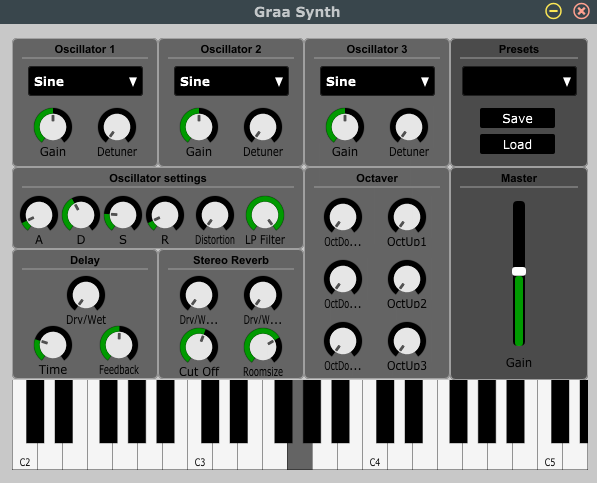

# graasynth
Graa Synth is a synthesizer written with Cabbage and Csound.

Work-in-progress

Features:
- 3 oscillators with octaver and detune options, plus individual gain controls
- Stereo reverb
- Delay
- Distortion
- Filters
- Save & load presets (currently unavailable)
